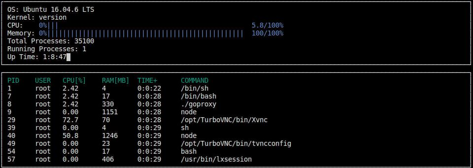

# Solution to System_Monitor

 Solution for System Monitor Project in the Object Oriented Programming Course of the Udacity C++ Nanodegree Program.

# Udacity Workspace

Udacity provides a browser-based Linux Workspace for students.

You are welcome to develop this project on your local machine, and you are not required to use the Udacity Workspace. However, the Workspace provides a convenient and consistent Linux development environment we encourage you to try.

# ncurses

ncurses is a library that facilitates text-based graphical output in the terminal. This project relies on ncurses for display output.

Within the Udacity Workspace, `.student_bashrc` automatically installs ncurses every time you launch the Workspace.

If you are not using the Workspace, install ncurses within your own Linux environment: `sudo apt install libncurses5-dev libncursesw5-dev`

# Make

This project uses Make. The Makefile has four targets:

1) `build` compiles the source code and generates an executable
2) `format` applies ClangFormat to style the source code
3) `debug` compiles the source code and generates an executable, including debugging symbols
4) `clean` deletes the build/ directory, including all of the build artifacts
